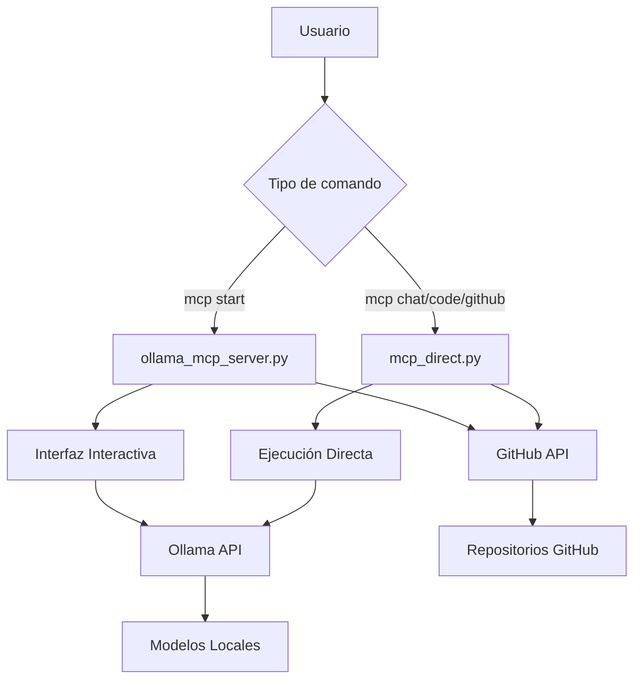

# 📖 Documentación Técnica - Ollama MCP Server

## 🏗️ Arquitectura del Sistema

El Ollama MCP Server está diseñado como un sistema modular que prop```
mcp-servers/
├── ollama_mcp_server.py    # ✅ Servidor principal interactivo
├── mcp_direct.py          # ✅ Comandos directos
├── install.py             # ✅ Instalador automático
├── requirements.txt       # ✅ Dependencias mínimas
├── .env                   # ✅ Configuración real (gitignore)
├── .env.example          # ✅ Plantilla de configuración
├── .bashrc.example       # ✅ Configuración terminal optimizada
├── README.md             # ✅ Documentación de usuario
├── DOCUMENTATION.md      # ✅ Este archivo - documentación técnica
└── .venv/               # ✅ Entorno virtual
```o a IA local y recursos de GitHub desde cualquier directorio del sistema.

### Componentes Principales

#### 1. **ollama_mcp_server.py** - Servidor Interactivo
- **Función**: Servidor principal con interfaz de comandos interactiva
- **Uso**: `mcp start` -> Abre terminal interactivo `🤖 MCP>`
- **Modelos**: 
  - `llama3.1:8b` para chat general
  - `deepseek-coder:6.7b` para asistencia de código
- **Funciones**:
  - Chat con modelos locales
  - Búsqueda y análisis de repositorios GitHub
  - Análisis y revisión de código
  - Obtención de archivos específicos de repos

#### 2. **mcp_direct.py** - Comandos Directos
- **Función**: Ejecutor de comandos directos sin interfaz interactiva
- **Uso**: `mcp chat "pregunta"`, `mcp code "consulta"`, etc.
- **Beneficio**: Permite usar el agente desde cualquier proyecto sin cambiar de directorio

#### 3. **install.py** - Instalador Automático
- **Función**: Configuración automática del entorno
- **Tareas**:
  - Verificar Ollama instalado
  - Crear entorno virtual
  - Instalar dependencias
  - Descargar modelos recomendados
  - Configurar aliases

### Flujo de Datos



## 🔧 Configuración del Sistema

### Variables de Entorno (.env)

```bash
# Token de GitHub (REQUERIDO)
GITHUB_TOKEN=tu_token_aqui

# Configuración de Ollama (opcional)
OLLAMA_URL=http://localhost:11434
DEFAULT_MODEL=llama3.1:8b
CODING_MODEL=deepseek-coder:6.7b

# Configuración del servidor (opcional)
SERVER_HOST=localhost
SERVER_PORT=8000
```

### Configuración del Terminal (.bashrc)

El archivo `.bashrc.example` contiene:

1. **Función principal `mcp()`**: Maneja todos los comandos
2. **Aliases directos**: `ai-chat`, `ai-code`, `ai-github`
3. **Comandos de análisis**: `analyze`, `review`
4. **Gestión de modelos**: `mcp models`, `mcp pull`

## 🚀 Modos de Operación

### Modo Interactivo (ollama_mcp_server.py)

**Ventajas**:
- Conversación continua con contexto
- Interfaz completa con todos los comandos
- Ideal para sesiones largas de desarrollo

**Desventajas**:
- Requiere terminal dedicado
- Hay que estar en el directorio del proyecto

### Modo Directo (mcp_direct.py)

**Ventajas**:
- Acceso instantáneo desde cualquier directorio
- Perfecto para consultas rápidas
- Se integra en workflows existentes

**Desventajas**:
- Sin contexto entre comandos
- Menos funciones interactivas

## 🔍 Funciones Principales

### Chat con IA Local
```python
def _ollama_request(self, model: str, prompt: str, system: str = "") -> str:
    """Solicitud HTTP a la API local de Ollama"""
    data = {
        "model": model,
        "prompt": prompt,
        "stream": False
    }
    if system:
        data["system"] = system
    
    response = requests.post(f"{self.ollama_url}/api/generate", json=data)
    return response.json().get('response')
```

### Integración con GitHub
```python
def github_search(self, query: str) -> str:
    """Búsqueda de repositorios en GitHub"""
    headers = {'Authorization': f'token {self.github_token}'}
    url = "https://api.github.com/search/repositories"
    params = {'q': query, 'sort': 'stars', 'order': 'desc', 'per_page': 5}
    
    response = requests.get(url, headers=headers, params=params)
    return self._format_github_results(response.json())
```

### Análisis de Código
```python
def analyze_code(self, code: str) -> str:
    """Análisis profundo de código con IA especializada"""
    system_prompt = """Eres un experto en análisis de código. Analiza el código
    proporcionado y proporciona insights sobre:
    - Calidad y estructura
    - Posibles mejoras
    - Bugs potenciales
    - Mejores prácticas"""
    
    return self._ollama_request(self.coding_model, code, system_prompt)
```

## 📁 Estructura de Archivos

```
~/mcp-servers/
├── ollama_mcp_server.py    # Servidor principal interactivo
├── mcp_direct.py          # Comandos directos
├── install.py             # Instalador automático
├── requirements.txt       # Dependencias mínimas
├── .env                   # Configuración real (gitignore)
├── .env.example          # Plantilla de configuración
├── .bashrc.example       # Configuración terminal optimizada
├── README.md             # Documentación de usuario
├── DOCUMENTATION.md      # Este archivo - documentación técnica
└── .venv/               # Entorno virtual
```

## 🔐 Seguridad y Privacidad

- **Todo local**: Los modelos de IA funcionan completamente offline
- **GitHub API**: Solo accede a repositorios públicos (o privados si tienes acceso)
- **Sin telemetría**: No se envían datos a servicios externos
- **Tokens seguros**: GitHub token se almacena localmente en `.env`

## 🛠️ Desarrollo y Extensión

### Agregar Nuevos Comandos

1. **Servidor interactivo**: Agregar método a la clase `OllamaMCPServer`
2. **Comandos directos**: Agregar método a la clase `MCPDirect`
3. **Aliases**: Actualizar `.bashrc.example`

### Agregar Nuevos Modelos

```bash
# Instalar modelo
ollama pull nombre-del-modelo

# Usar en código
model = "nombre-del-modelo"
response = self._ollama_request(model, prompt)
```

### Integrar Nuevas APIs

```python
# Ejemplo: integración con API externa
def new_api_integration(self, query: str) -> str:
    headers = {'Authorization': f'Bearer {self.api_token}'}
    response = requests.get(f'https://api.example.com/search?q={query}', headers=headers)
    return self._process_response(response.json())
```

## 🚀 Optimización y Performance

### Recomendaciones

1. **Modelos eficientes**: 
   - `llama3.2:3b` para tareas ligeras
   - `qwen2.5-coder:7b` para código (balance velocidad/calidad)
   - `deepseek-coder:6.7b` para análisis profundo

2. **Caché de respuestas**: Implementar caché local para consultas repetidas

3. **Timeouts configurables**: Ajustar timeouts según capacidad del hardware

4. **Procesamiento en paralelo**: Para múltiples consultas simultáneas

### Monitoreo

```bash
# Ver uso de recursos de Ollama
ollama ps

# Monitorear logs del sistema
tail -f ~/.ollama/logs/server.log

# Estadísticas de uso
mcp status
```

## 🔄 Actualizaciones y Mantenimiento

### Actualizar Modelos
```bash
ollama pull llama3.1:8b      # Actualizar modelo existente
mcp models                   # Ver versiones instaladas
```

### Actualizar Dependencias

```bash
cd mcp-servers
.venv/bin/pip install --upgrade requests python-dotenv PyGithub
```

### Backup de Configuración
```bash
# Respaldar configuración
cp .env .env.backup
cp ~/.bashrc ~/.bashrc.backup
```

## 📊 Casos de Uso Avanzados

### Integración en IDEs

El sistema se puede integrar fácilmente en IDEs como VSCode mediante extensiones que ejecuten los comandos directos.

### CI/CD Pipelines

Los comandos directos pueden usarse en scripts de CI/CD para análisis automático de código:

```bash
# En un pipeline
analyze src/main.py > code_analysis.txt
review src/tests/ > code_review.txt
```

### Desarrollo de Equipos

Cada desarrollador puede tener su propia configuración mientras comparte los mismos scripts base.

---

*Esta documentación está en constante evolución. Para contribuir o reportar problemas, consulta el README principal.*
